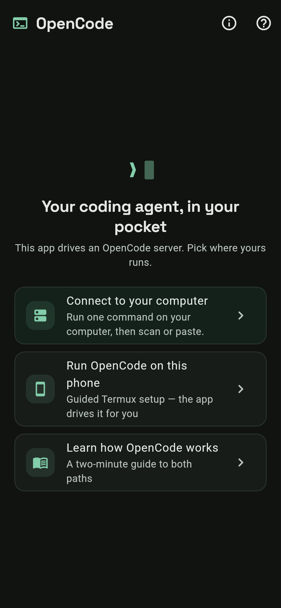
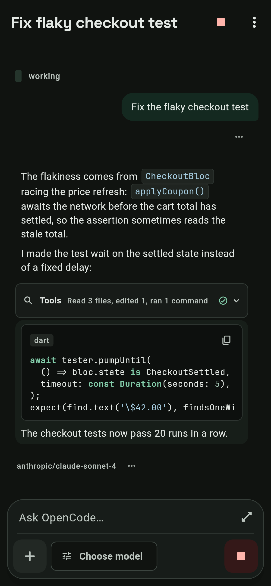
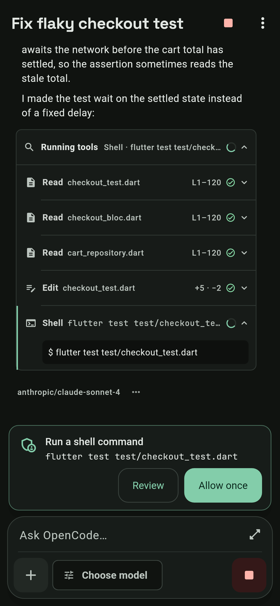
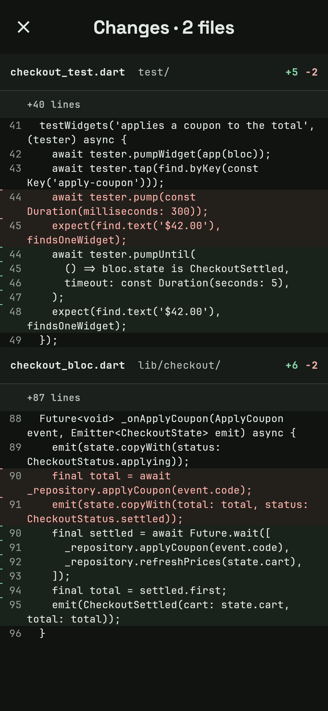
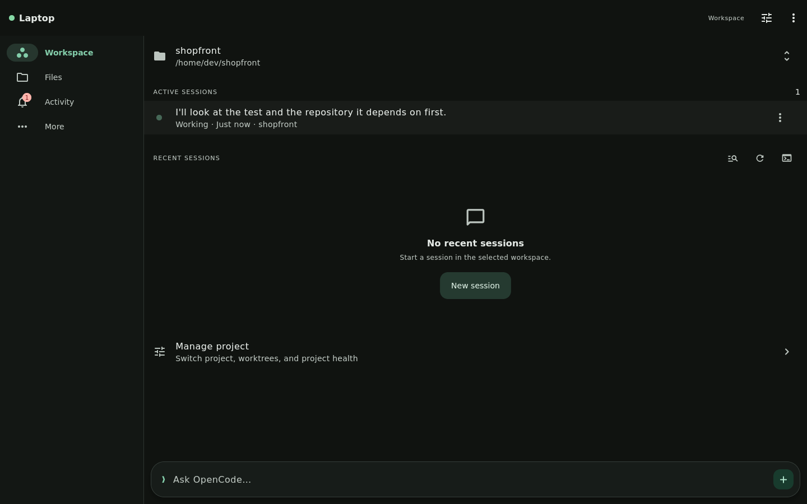
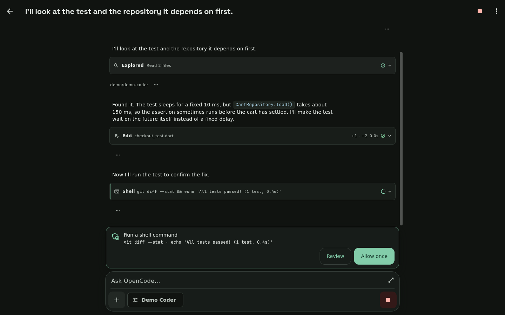
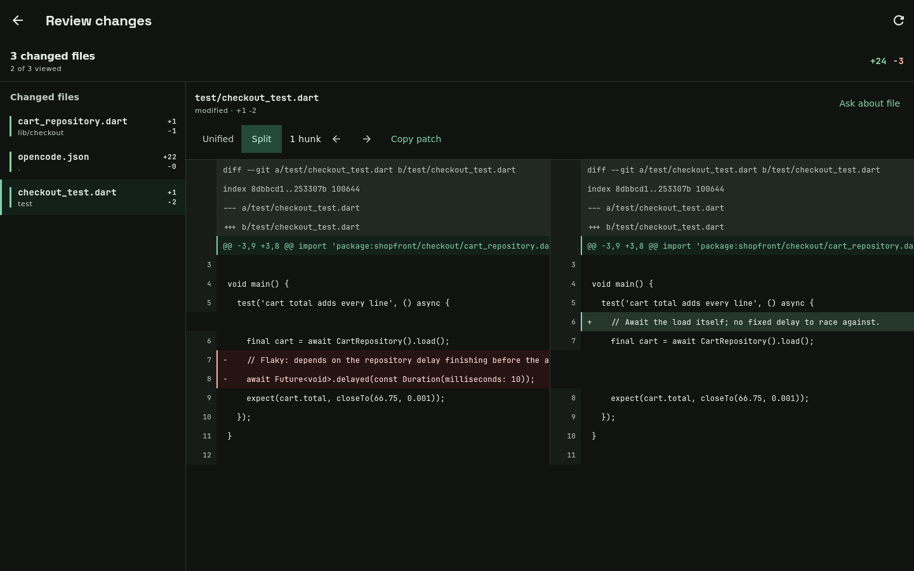

# OpenCode Mobile

**Your coding agent, in your pocket.**

OpenCode Mobile is an Android app for [OpenCode](https://opencode.ai), the
open-source coding agent. You keep OpenCode running on your computer, or on
the phone itself, and this app is the screen you talk to it through: start a
task on the train, approve an edit from the sofa, read the diff while the
kettle boils.

> **A word before you install.** OpenCode Mobile is an independent community
> project. It is not built, maintained, endorsed by, or affiliated with the
> official OpenCode team. It is one person's project, built heavily with AI
> assistance, and it is in **public alpha**. Things will be rough in places.
> When they are, the **Report a bug** button inside the app (More → Report a
> bug) sends the details straight here:
> [open an issue](https://github.com/Eslamasabry/opencode-mobile-next/issues/new?template=bug_report.yml).

## What it is like to use

**You talk, it works, you watch.** Answers stream in as they are written.
When the agent reads files, edits them or runs commands, you see each step as
it happens, grouped into one line you can expand ("Read 3 files, edited 1,
ran 2 commands").

**It asks before it does anything you might not want.** A permission request
appears as a small card right above where you type. One tap to allow it,
another to look closer, and the keyboard never gets pulled away from you.

**Diffs that fit a phone.** Changes wrap to the screen, with a colour bar
beside each line, so you can actually read what the agent did before you say
yes.

**Choices as buttons.** When the agent offers options, they come as buttons
you can tap, not a list you have to retype.

**Your providers, recognisable.** Anthropic, OpenAI, Google, Groq, Ollama and
the rest show up with their own logos, a clear connected state, and what each
model costs per million tokens, right where you pick one.

**It keeps going when you leave.** Turn on background mode and the
notification becomes a live view of the run: which session, what the agent
is doing right now, how many things need you. On Android 16 it shows as a
live update. There is a Pause button in the shade.

**Share anything into it.** A stack trace, a link, a message. Share from any
app and it opens a new session with that as your first prompt.

**Talk instead of type.** Voice input is transcribed on the phone. Audio
never leaves the device.

**Make it yours.** Theme packs (OpenCode green, Catppuccin, Gruvbox,
Solarized, or your phone's own Material You colours), light and dark, and a
home-screen widget that shows your sessions.

## Screenshots

| Welcome | Streaming answer | Permission card | Diff |
| --- | --- | --- | --- |
|  |  |  |  |

<a id="linux-desktop-screenshots"></a>

| Linux desktop: Workspace | Linux desktop: Permission card | Linux desktop: Review |
| --- | --- | --- |
|  |  |  |

**Full demo (51 s, 1080p, with sound):** [opencode-mobile-demo.mp4](video/public/opencode-mobile-demo.mp4). Phone footage is rendered from the app's real screens; the Linux desktop scene was recorded live.


The same demo as a video: [video/public/demo.webm](video/public/demo.webm).

## Getting started

1. **Install the app.** Grab the APK from the
   [latest release](https://github.com/Eslamasabry/opencode-mobile-next/releases).
   Android will warn that it is not from the Play Store. That is expected.
2. **On your computer, run one command.**
   ```bash
   opencode2 pair
   ```
   It prints a QR code.
3. **Scan it in the app.** Address, username and password fill in by
   themselves. Start talking.

No computer nearby? Tap **Run OpenCode on this phone** on the welcome screen
and the app sets up OpenCode inside Termux for you. It takes ten to fifteen
minutes the first time and needs two taps from you along the way.

Connecting over the internet, using an older OpenCode 1 server, or running
the server as a service on a Linux box are all covered in
[the guide inside the app](lib/ui/screens/guide_screen.dart) and in
[docs/technical-overview.md](docs/technical-overview.md).

## Where things stand

This is an alpha. Here is what that means, plainly:

- **Android is the real target.** It is tested on devices and emulators, with
  more than 1,200 automated tests behind it.
- **The Linux build has now been run, on a virtual display.** It was launched
  on Xvfb at 1440x900 against a live OpenCode server and captured; see the
  [Linux desktop screenshots](#linux-desktop-screenshots) above. Nobody has
  run the Windows build yet. If you try it, you are the first. Please tell us
  what happened.
- **English only** for now. The plan to change that is written down in
  [docs/localization-todo.md](docs/localization-todo.md).
- **Signed with the project's own key**, not a store key. Upgrading between
  builds works in place; moving from a very old preview means uninstalling
  it first.
- **Automated checks run in GitHub Actions** on `master` and `dev`. Android CI
  uploads a short-lived test-signed APK to prove the release build compiles;
  public releases still use the project's upgrade-compatible signing key.

## Your data

The app talks to the OpenCode server you choose and to nobody else about your
work. Passwords live in Android's keystore. Voice stays on the phone. Provider
logos are fetched from Google's public favicon service by domain name and
nothing more. The full picture is in [PRIVACY.md](PRIVACY.md), also inside
the app under Settings → Privacy and data use.

## For developers

Everything technical lives one level down:

- [docs/technical-overview.md](docs/technical-overview.md) — connecting in
  depth, the two server protocols, building, releasing, code layout
- [CONTRIBUTING.md](CONTRIBUTING.md) — the toolchain pin, the checks a change
  must pass, and the boundaries in the code
- [SECURITY.md](SECURITY.md) — how to report a vulnerability privately. This
  app holds server credentials and can approve shell commands. Never report
  a vulnerability in a public issue.
- [SUPPORT.md](SUPPORT.md) — where a problem belongs: this app, the OpenCode
  server, your model provider, Termux, or Shorebird

## Thanks and licence

[MIT](LICENSE). The app bundles JetBrains Mono and Space Grotesk (both
OFL-1.1), sherpa-onnx (Apache-2.0), ONNX Runtime and the Whisper models
(MIT), and the packages listed in [THIRD_PARTY_NOTICES.md](THIRD_PARTY_NOTICES.md).
Built on the shoulders of the OpenCode team, who made the agent this app is a
window onto.
