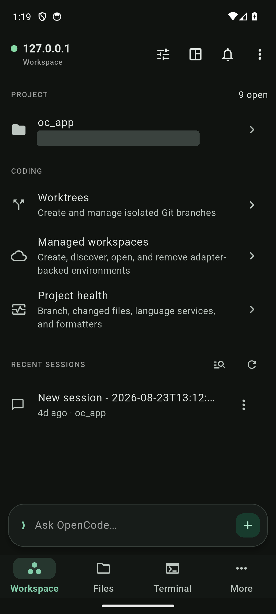
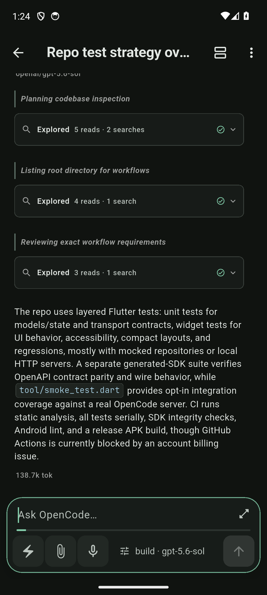
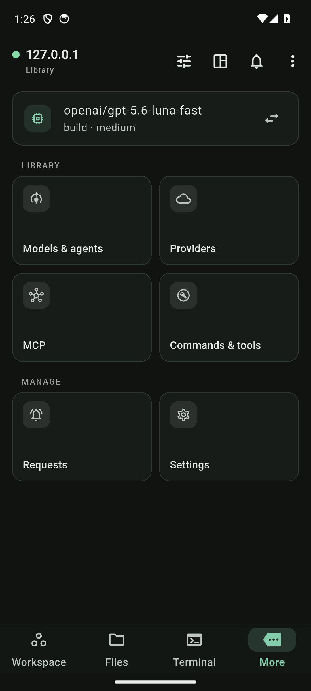
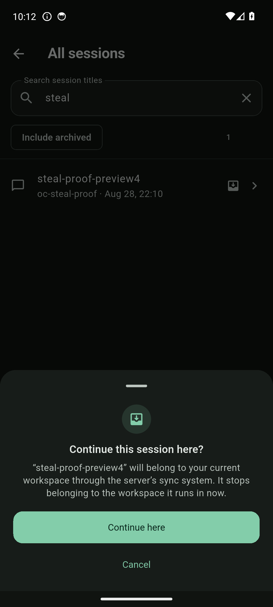

# OpenCode mobile

> **Not affiliated with OpenCode.** OpenCode Mobile is an independent
> community project. It is not built, maintained, endorsed by, or affiliated
> with the official OpenCode team.

A native Android client for [OpenCode](https://opencode.ai) — the coding
agent, in your pocket. It connects to an `opencode serve` instance on your
dev box through a tunnel that ends at the phone's own loopback, or runs
**fully on-device** with the server inside Termux, driven and installed by
the app itself. The same codebase builds a working Linux desktop binary.

## Status

This is a **preview line, not a stable release**. The current cut is
[v1.0.29+30-preview.9](https://github.com/Eslamasabry/opencode-mobile/releases/tag/v1.0.29%2B30-preview.9)
(`oc_app-1.0.29+30-convergence-preview9.apk`); `v1.0.19+20` is the last
stable cut. The navigation changed in preview 9, so screenshots and videos
from earlier previews no longer match the app — see the captions below.

The app ships **English only**. Strings are routed through the localization
layer but only `en` is supplied; there is no second locale to switch to.

Two independent audits of this repository — a public-launch readiness audit
and a UI/UX audit — are published under [docs/audits/](docs/audits/), along
with a [post-remediation status](docs/audits/post-remediation-status-2026-08-29.md)
recording, finding by finding, what has actually been closed and what has
not. Read that before treating anything here as production-ready.

## The app

Four primary destinations: **Workspace**, **Files**, **Activity**, **More**.
Terminal is not a destination — it lives in More and opens from inside a
session.

- **Workspace is session-first.** A compact context header names the current
  project, and one sheet switches project and workspace. Below it: active
  sessions, then recent, then archived. Everything else about the project —
  worktrees, managed workspaces, project health — sits behind a single
  *Manage project* entry, so the screen answers "continue or start work"
  rather than "configure a project". A docked quick-ask pill
  (`Ask OpenCode…`) starts a new session from anywhere on the screen.
- **Chat with live tool streaming** — prompts stream token by token behind a
  terminal-style blinking caret; consecutive tool calls group into a growing
  run with a live ticker (`Shell · flutter test…`); tool cards expand to
  full input/output; markdown, fenced code with syntax highlighting and
  copy, reasoning blocks, image/file previews.
- **The Prompt tools composer.** The composer's secondary controls collapse
  behind one `+` button that opens a *Prompt tools* sheet with three
  full-width rows: **Commands** (slash commands and agents), **Attach file**,
  and **Voice input**. The model and agent sit beside it as a context chip,
  not a fourth icon. The result is a prompt field that keeps nearly the whole
  composer width on a 360 dp phone at 2.5× text instead of a quarter of it.
  Attachments are staged, not saved with the draft, and the composer says so.
- **Review references reach the prompt.** In the Review workspace or the
  Files *Changes* sheet, stage a file, a changed file, a hunk, a selection,
  or a review comment. Staged references appear as removable chips above the
  composer and fold into the message text when you send — no clipboard round
  trip, and nothing is uploaded. Up to ten per session.
- **Activity** — one destination for everything that needs you: *Needs
  attention* (permissions, questions, session forms, each row opening the
  exact resolver), *Server requests* (global MCP forms), *Running* sessions
  with live subagent counts, *Recently completed*, and a bridge to the
  all-project session finder. It carries the app's single pending badge.
- **Context window meter** — the divider under the composer is an ambient
  gauge of the current model's context window, filling from the newest
  assistant message's token totals, with escalating colors at 70% and 90%.
- **Model & agent picker** — the full server catalog (349 models on a stock
  install) with search, variant chips, and a pinned apply bar that never
  scrolls away. Selection persists per server.
- **Permissions from the notification shade** — approve a tool call, deny
  it, or answer the agent's question without opening the app; every action
  is bound to its exact request ID. An opt-in foreground service keeps live
  sessions streaming in the background and across device sleep. Android 15+
  caps that service at six background hours per rolling day.
- **File browser + diff review** — type-aware browsing with symbol search
  and source-line navigation from the language server, a standing changed-
  files card with `+/-` totals, and a Review workspace with session,
  working-tree, and branch scopes, unified/split modes, line selection,
  prompt comments, and viewed-file progress counts.
- **A real terminal** — server-side PTY rendered through xterm.dart,
  cursor-safe across app sleep/wake. Reached from **More**, or from inside a
  session.
- **Theme packs** — Catppuccin, Gruvbox, Solarized, or Android's own
  Material You dynamic color; JetBrains Mono throughout.
- **Offline compose queue** — prompts written on a dead connection queue as
  editable bubbles and flush in order on reconnect (experimental).
- **Home-screen widget** — up to four sessions with working/idle status
  dots; tap a row to land in that exact chat. Updates ride the app's own
  refreshes, so it costs no battery.
- **Session steal & global finder** — search sessions across every project
  on the server (title search, archived included, cursor pagination) and
  continue a workspace session from another device on the phone.
- **Local voice input** — on-device Whisper transcription via sherpa-onnx;
  model packs download on demand, audio never leaves the phone.
- **Shorebird code push** — Dart-side fixes reach installed devices without
  a new APK; the app owns update checks, download progress, and restart.

Server profiles authenticate with HTTP basic auth
(`OPENCODE_SERVER_PASSWORD`); secrets live in the Android Keystore. Data
handling is documented in the [privacy policy](PRIVACY.md), also bundled
under **Settings → Privacy and data use**.

## Screenshots

**These are from the 1.0.27+28 preview 7 build and predate the preview 9
navigation change.** They show the old five-destination layout with Terminal
as a tab and Mission Control as its own surface. They are kept because the
chat, run and sheet surfaces are still representative; the navigation is not.
Current screenshots have not been recut.

| Workspace (preview 7) | Live run (preview 7) | More grid (preview 7) | Session steal (preview 7) |
|---|---|---|---|
|  |  |  |  |

The project row in the first shot carries a solid redaction bar: the capture
showed the recording machine's absolute project path, which is not something a
screenshot needs to prove. Nothing else in these four is retouched.

A 2.5-minute showcase video was cut from the same preview 7 build and has
been withdrawn for the same reason, at greater length: it was recorded from
real sessions and showed a local home directory path and conversation content
on screen. The Remotion source lives in [`video/`](video/) with its storyboard
in [docs/showcase-video-plan.md](docs/showcase-video-plan.md), so it can be
re-cut from footage recorded against a scratch project.

## Install

Grab the APK from the
[latest release](https://github.com/Eslamasabry/opencode-mobile/releases).

**The next build will not upgrade preview 10 — it installs beside it.** The
Android application ID moved from `ai.opencode.opencode_mobile` to
`io.github.eslamasabry.opencode_mobile`. The old one sat under `opencode.ai`,
the OpenCode project's own reverse domain, which this project does not
control; Android treats the application ID as permanent product identity, so
it had to move before anything ships stable. To Android the result is a
*different app*: it installs alongside the preview you already have instead
of replacing it, and both will show in the launcher under the same name and
icon. Uninstall the old one by hand first, and expect to sign in and set up
your servers again — app data does not carry across an application ID
change. This is a one-time break; the new ID is permanent.

**Honest signing caveat:** these APKs are sideload builds signed with the
project's own certificate, not a Play Store production key. Android will
warn about unknown sources — that is expected. The signing lineage is
stable and pinned, so previews upgrade in place once past the ID change
above: certificate SHA-256
`1de5bf08146f269bcd9eb5c2ffc94469ce4617d37806285955f978a62494d60c`. Verify
any downloaded APK with
`apksigner verify --print-certs app.apk` and compare against that
fingerprint and the SHA-256 listed in the release notes.

## Connect to a server

An OpenCode server runs shell commands as your user. Treat app access to it
like SSH access, and do not put one on a network you do not control.

Start OpenCode on the machine with your code, bound to loopback:

```bash
OPENCODE_SERVER_PASSWORD=your-secret \
  opencode serve --hostname 127.0.0.1 --port 4096
```

**Pair, don't type.** On an OpenCode 2 server, `opencode2 pair` prints the
server's addresses, the username, and the current serve password, together
with a QR encoding all three:

```bash
opencode2 pair
```

In the app's server editor, tap **Scan** and point the camera at that QR
(Android), or copy what it printed and tap **Paste pairing code** (anywhere,
no permissions). The app fills the address, username and password in one
step, tries each address the code carries, and names the one it connected
to. It is strictly less work than copying a 32-byte random password by hand,
and there is nothing to mistype.

The pairing code carries the serve password, so it is as good as shell
access to that machine — treat it accordingly, and note that it goes stale
whenever the server restarts without `OPENCODE_SERVER_PASSWORD` set.
OpenCode 1 servers have no `pair` command, so the manual path below remains
for them, and for anyone who prefers it.

Pairing supplies credentials, not a route. The app refuses plain HTTP to
anything but the phone's own loopback, so the server stays on `127.0.0.1`
and you bring the connection to the phone through a tunnel that ends at
`127.0.0.1` there too:

- **USB / adb (simplest)** — with the phone plugged in and USB debugging on,
  `adb reverse tcp:4096 tcp:4096`, then connect the app to
  `http://127.0.0.1:4096`. Zero network setup; ideal for a desk-adjacent
  phone or emulator.
- **SSH** — any SSH client on the phone that forwards a local port works:
  forward phone-local `4096` to `127.0.0.1:4096` on the host, then connect
  to `http://127.0.0.1:4096`.
- **HTTPS** — Tailscale Serve or another reverse proxy that terminates TLS
  in front of the server; connect to the `https://` address. Plain
  `http://<hostname>:4096` across a network is rejected by the app, because
  the password would cross it in clear text. Binding the server itself to a
  network interface is an advanced path, requires
  `OPENCODE_ALLOW_REMOTE_BIND=1`, and should only be taken behind TLS.
- **On-device (Termux)** — tap **On-device (Termux)** on the Servers
  screen. The app detects Termux (or opens its F-Droid page), walks you
  through the one required unlock line, installs Ubuntu via proot-distro
  plus Node and `opencode-ai` in the chroot, launches
  `opencode serve` detached, health-polls until live, and connects. A "Live
  log in Termux" button streams install/server logs at any time. The native
  side is
  [`MainActivity.kt`](android/app/src/main/kotlin/io/github/eslamasabry/opencode_mobile/MainActivity.kt)
  + [`lib/termux/bridge.dart`](lib/termux/bridge.dart). (Why the chroot:
  plain-Termux npm installs of opencode are broken upstream — npm sees
  `os=android` and no `opencode-android-arm64` package exists. The chroot is
  real glibc and shares the network stack, so the app reaches it at
  `127.0.0.1:4096`.) Prefer manual? Inside Termux:

  ```bash
  pkg install proot-distro
  proot-distro install ubuntu
  proot-distro login ubuntu     # then inside the chroot:
    apt update && apt install -y nodejs npm
    npm i -g opencode-ai
    opencode serve --hostname 127.0.0.1 --port 4096 &
    exit
  ```

  Run `termux-wake-lock` to keep it alive.

For a persistent Linux host, [docs/ubuntu-host.md](docs/ubuntu-host.md) and
[`scripts/host/ubuntu-opencode.sh`](scripts/host/ubuntu-opencode.sh) install
a `systemd --user` service bound to `127.0.0.1` with a generated password
kept in a `0600` env file, and print the tunnel commands. The app's
**Settings → Ubuntu host management** shows the same commands with your
port filled in. Leave your firewall closed: opening a port does nothing for
you and everything for anyone else on the network.

## OpenCode 2

The app speaks **both protocols**. The existing v1 client keeps serving
current 1.18.x servers (including Termux installs); a typed `lib/api2/`
client speaks the v2 beta API (`opencode2`) — Basic-auth transport, the
`/api/` surface, cursor pagination, forms, inbox delivery, and WebSocket
PTY — and both sit behind one protocol-neutral gateway, so the screens
never know which server they are talking to.

Protocol detection happens at connect time: paste an address, and a v2
server announces itself (a `401` on `/api/health`) so the app asks for
its serve password. Against a v2 server you get streamed turns, forms
in place of questions, permission approvals with a reason, steer-or-queue
sends (a labelled control, not a hidden long press), a real terminal over
ticketed WebSockets, and native rendering of v2's own message shapes. Every
capability is negotiated, so features a server does not implement are not
offered.

Plan and status: [docs/opencode2-port-plan.md](docs/opencode2-port-plan.md);
captured ground truth in [docs/opencode2-protocol-notes.md](docs/opencode2-protocol-notes.md),
[docs/opencode2-port-matrix.md](docs/opencode2-port-matrix.md), and the live
OpenAPI dumps under [contracts/](contracts/).

## Build from source

| Tool | Version |
|---|---|
| Flutter | **3.47.1** — the exact version pinned for Shorebird releases |
| Android SDK | API 36 |
| Shorebird CLI | 1.6.x (only needed for release/patch work) |

```bash
flutter pub get
flutter run                  # debug on device/emulator
flutter build apk --release
flutter build linux          # desktop build, same codebase
```

The Flutter pin matters: release artifacts and the 912-test suite are
validated against Shorebird's pinned 3.47.1
(`~/.shorebird/bin/cache/flutter/<rev>/bin/flutter` after installing
Shorebird). Older local Flutters may fail to resolve packages. Run tests
serially — `flutter test --concurrency=1`.

Two integration tests run against any live server, no emulator needed:

```bash
opencode serve --port 4123 &
dart run tool/smoke_test.dart http://127.0.0.1:4123 /server/project
dart run tool/prompt_test.dart http://127.0.0.1:4123   # needs model auth
```

## Releases and code push

`./scripts/release.sh {release|patch|sideload}` is fail-closed: it demands a
clean synced `master`, runs analysis, the full test suite, and a Shorebird
dry-run, and uploads nothing without an explicit `--publish`. Release
signing reads the gitignored `android/key.properties`
([example](android/key.properties.example)); no keystore or populated
properties file is ever committed. The GitHub sideload lane hard-pins the
public certificate fingerprint above and independently verifies signer,
package ID, and version on every artifact. Shorebird patches are Dart-only
and always target an exact `x.y.z+build`; never distribute an APK from a raw
`flutter build apk` — it cannot receive patches.

**CI is defined but not currently running.**
[android-quality.yml](.github/workflows/android-quality.yml) encodes the same
gates plus contract/SDK verification and a test-signed release compile whose
artifact is never distributed, but every recorded run has failed in seconds
on a GitHub account-level billing block. Until that is resolved by the
repository owner, no release here is backed by CI evidence — the gates were
run locally. The workflow file says so at the top, and so does this README,
because a green-looking badge nobody can run is worse than no badge.

## Architecture

```
lib/
├── api/           # v1 client: DTOs, Dio HTTP client, /event SSE w/ reconnect
├── api2/          # OpenCode 2 client: Basic-auth transport, typed models, SSE
├── domain/        # protocol-neutral gateway over v1 and v2
├── state/         # profiles (Keystore secrets), ConnectionController,
│                  #  offline queue, session drafts, review→prompt handoff
├── termux/        # Dart side of the Termux RUN_COMMAND bridge
├── background/    # foreground service, live-session notifications, home widget
├── voice/         # sherpa-onnx Whisper: model manager, downloader, recognizer
├── update/        # Shorebird update ownership
├── diagnostics/   # redacted, explicit-only app diagnostics
└── ui/            # screens (workspace, chat, files, review, activity,
                   #  terminal, more hub, settings…) and widgets
packages/opencode_sdk/   # generated Dart SDK from the checked-in OpenAPI contract
contracts/               # OpenAPI dumps (v1 + v2 beta) + SDK coverage matrix
video/                   # Remotion showcase project
```

UI talks to the gateway, never to `api/` or `api2/` directly. See
[CONTRIBUTING.md](CONTRIBUTING.md) for the boundaries a change must respect.

## Contributing, security, and support

- [CONTRIBUTING.md](CONTRIBUTING.md) — toolchain pin, the gates a change must
  pass, architecture boundaries, and PR expectations
- [SECURITY.md](SECURITY.md) — how to report a vulnerability privately. This
  app stores server credentials and can authorize shell-capable actions;
  never report a vulnerability in a public issue.
- [SUPPORT.md](SUPPORT.md) — where a problem belongs: this app, the OpenCode
  server, your model provider, Termux, or Shorebird
- [CODE_OF_CONDUCT.md](CODE_OF_CONDUCT.md) — Contributor Covenant 2.1
- [PRIVACY.md](PRIVACY.md) — what is stored, where, and what deleting a
  server profile actually removes

## Project docs

- [docs/audits/](docs/audits/) — the two independent audits and the
  [post-remediation status](docs/audits/post-remediation-status-2026-08-29.md)
- [docs/ubuntu-host.md](docs/ubuntu-host.md) — a `systemd --user` server on an
  Ubuntu host ([script](scripts/host/ubuntu-opencode.sh))
- [docs/opencode2-port-plan.md](docs/opencode2-port-plan.md) /
  [port matrix](docs/opencode2-port-matrix.md) /
  [protocol notes](docs/opencode2-protocol-notes.md) — the v2 lane
- [docs/opencode2-ui-design.md](docs/opencode2-ui-design.md) — locked UI
  decisions for v2 surfaces (forms, integrations, inbox)
- [docs/opencode2-termux.md](docs/opencode2-termux.md) — the on-device story
  under OpenCode 2
- [docs/design-inspiration.md](docs/design-inspiration.md) — the researched
  pattern library behind the facelift
- [docs/desktop-feasibility.md](docs/desktop-feasibility.md) — Linux desktop
  findings. The desktop build compiles and runs; it has no dedicated
  interaction layer yet and should be treated as experimental.
- [docs/opencode-sdk-coverage.md](docs/opencode-sdk-coverage.md) /
  [command feature map](docs/opencode-command-feature-map.md) — how much of
  the server API the app exercises
- [docs/showcase-video-plan.md](docs/showcase-video-plan.md) — the showcase
  storyboard, shot list, and render plan

## License

[MIT](LICENSE). Bundled
third-party components — JetBrains Mono (OFL-1.1), sherpa-onnx
(Apache-2.0), ONNX Runtime (MIT), OpenAI Whisper models (MIT), and every
runtime package resolved in `pubspec.lock` — are documented in
[THIRD_PARTY_NOTICES.md](THIRD_PARTY_NOTICES.md) with license texts under
[LICENSES/](LICENSES/).
