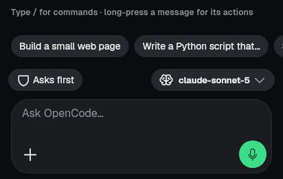
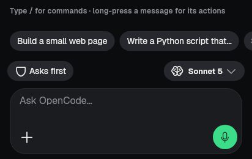

# FC5 — model chip names its model while the models load (2026-10-07)

Finish line: a new conversation's model chip never shows a raw model id
(`claude-sonnet-5`, `anthropic/claude-sonnet-5`) before the catalog name.
Non-goal: changing the catalog names themselves.

## Change
- `lib/domain/model_display_name.dart`: `modelNameFromId` makes a readable
  name from an id ("claude-sonnet-5" → "Sonnet 5", "claude-opus-4-1-20250805"
  → "Opus 4.1", "gpt-6-sol" → "GPT-6 Sol").
- Used while the catalog is missing or loading, after a name seen before
  (`knownModelName`), in three chips:
  - the chat composer chip (`chat/chat_command_actions.dart` `_presentedModelLabel`),
  - the new-conversation chip on Chats (`library_screen.dart` `defaultModelLabel`,
    which used to show `anthropic/claude-sonnet-5`),
  - a phone agent's new-conversation chip (`agents/agent_model_sheet.dart`).

## Evidence
Capture: `tool/capture/fc_chat_2026_10_07_test.dart` (`FC_ONLY=FC5`), catalog
not loaded, selected model `anthropic/claude-sonnet-5`.

| Before | After |
|---|---|
|  |  |

Full screens: `before-model-chip-loading.jpg`, `after-model-chip-loading.jpg`.

## Tests
`test/model_name_from_id_test.dart` (19 tests): id → name table, the
new-conversation label while loading / with a remembered name / with the
catalog, and the chat composer chip while loading. With the fix reverted the
two loading tests fail (raw id shown); with it, all pass.
