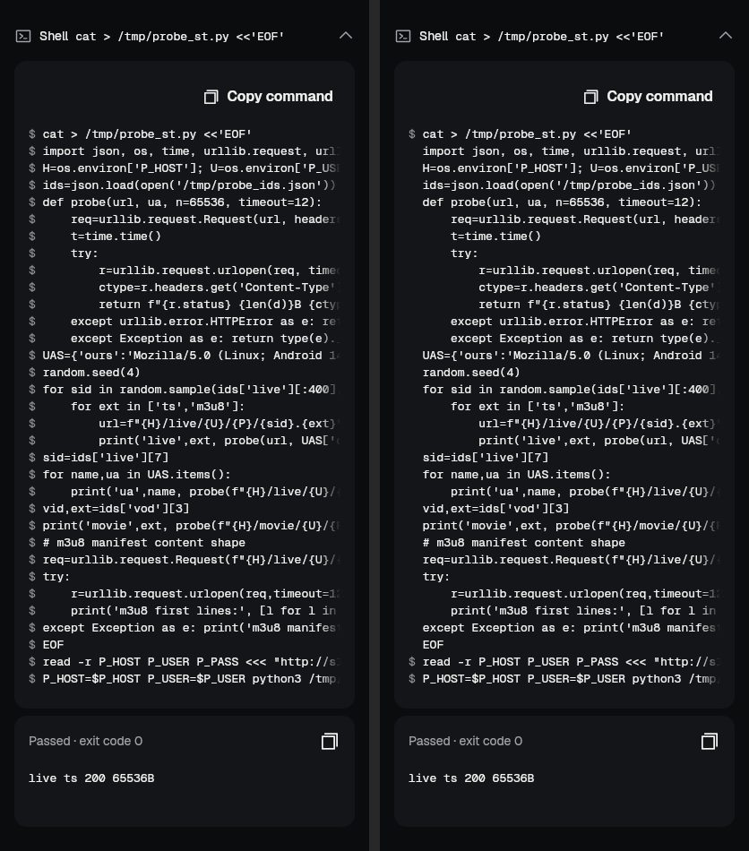

# Command block: one `$` per command, no thumb on the code (2026-10-07)

Owner report from the phone (Claude Code chat, release 1.2.0): a shell step that writes a Python file with a
heredoc showed `$` before every line, and the sideways scroll indicator sat over the code.

| | Before | After |
|---|---|---|
| Prompts | `$` on all 33 lines | `$` on the 3 lines that start a command (`cat … <<'EOF'`, `read …`, `P_HOST=… python3 …`) |
| Scroll indicator (touch) | painted at rest | shows only while the code is swiped; the end fade marks a long line; a free strip stays under the last line |

- Renders: `tool/capture/command_block_test.dart` (412 dp, dark theme, the owner's script with the host replaced).
  Not an emulator capture.
- The indicator landing mid-block (as in the owner's screenshot) did not reproduce in tests; the fix removes the
  at-rest thumb on touch, so it cannot sit on the code.
- Rules (`kitCommandLineStarts`): heredoc body and terminator (`<<`, `<<-`, not `<<<`), trailing `\` `|` `&&` `||`,
  open quotes, open `(`/`{`/`$(`, and `if`/`for`/`while`/`until`/`case`/`select` bodies continue the command.
  Copy still copies the source unchanged.
- Tests: `test/kit/kit_code_block_prompt_test.dart` (9; the two widget tests fail with the fix reverted),
  `kit_code_block` goldens updated (thumb gone at rest only), redaction allowlist entry for FA1's Copy code.
