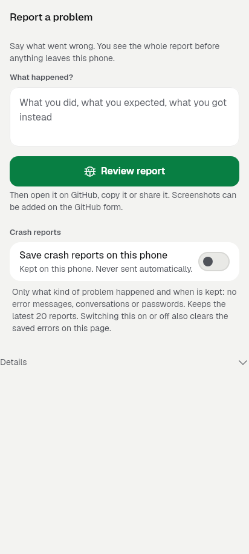
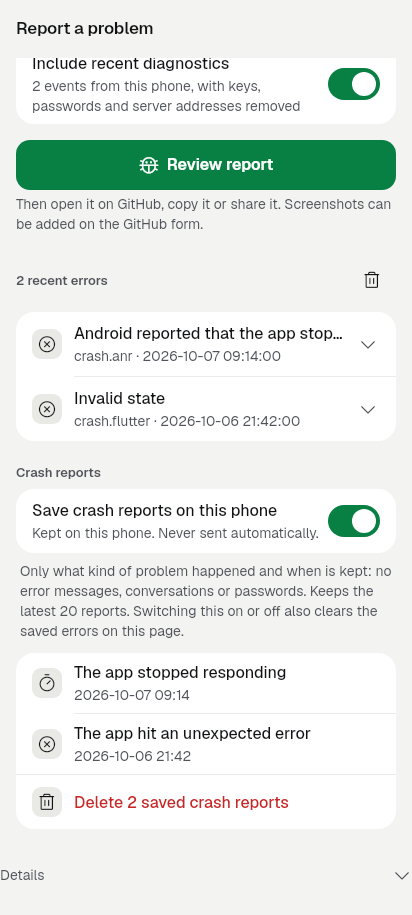
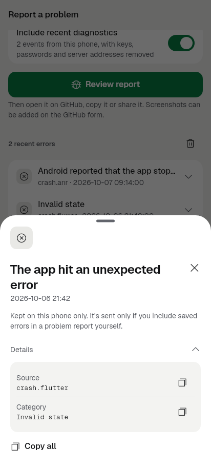
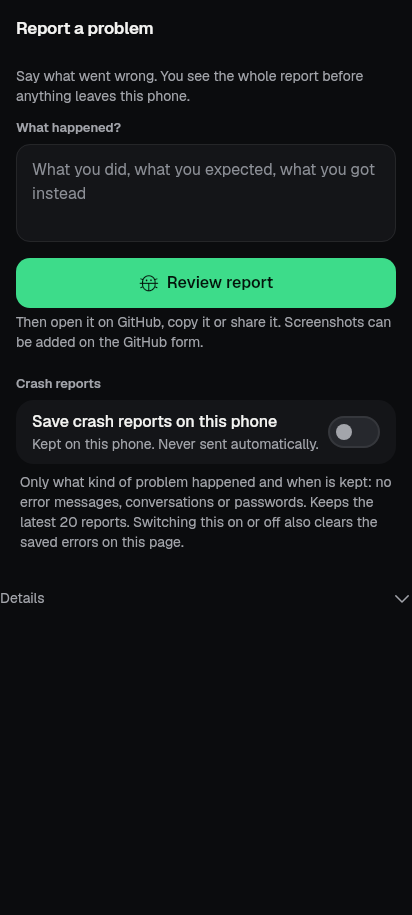
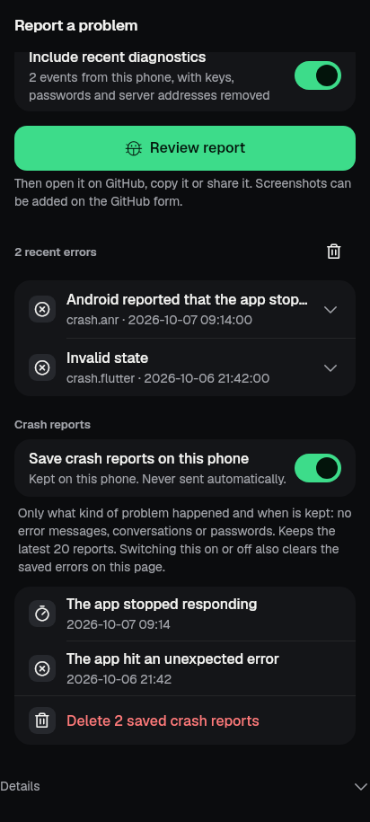
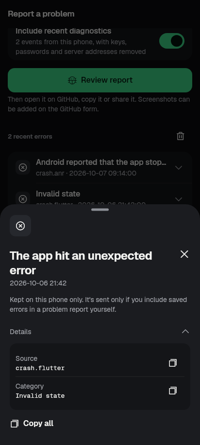

# Crash reports consent UI (BD7) — evidence (2026-10-08)

Feature: on Report a problem (App diagnostics) the person can turn on saving
crash and "stopped responding" reports on this phone, see what is kept, open a
saved report, delete saved reports, and turn saving off. Backend contract:
[bd7-contract](../../design/bd7-contract.md) · privacy:
[bd7-crash-diagnostics](../../privacy/bd7-crash-diagnostics.md) · backend
evidence: [bd7-2026-10-07](../bd7-2026-10-07/README.md).

## Setup

- Branch `fe/crash-consent` from `feat/genui-fe` at `e2b3fe16`.
- Widget tests and goldens only (pinned Flutter 3.47.1, run through
  `tool/qa/machine_lock.sh`). No emulator, no APK, no device run.
- A real `CrashDiagnosticsController` on a temporary directory; no native channel.

## What was built

- `lib/ui/screens/crash_reports_section.dart`: the section, built from kit parts
  only (`KitRowGroup`, `KitSwitchRow`, `KitGroupNote`, `KitRow`, `KitNotice`,
  `showKitSheet`, `KitDetailsFold`, `showKitConfirm`).
- `AppDiagnosticsScreen` places it under the errors list, above the timings.
  It takes an optional `crash` and `crashReady` (for tests); the app uses
  `CrashDiagnosticsStartup.current` / `.ready`.
- `CrashDiagnosticsController.records` + `CrashRecord`: a read-only list of the
  saved records, newest first (the thin Dart accessor the UI needed). Capture,
  storage, defaults and native code are unchanged.
- Copy: 19 new keys in `app_en.arb` and `app_ar.arb` (Arabic fully translated).

## Behaviour

| State | What the person sees |
|---|---|
| Start-up still opening the store (≤300 ms) | Nothing, so the page does not flicker |
| Store could not open | Switch shown but turned off, with the reason "Crash reports aren't available right now. Restart the app and try again." (hidden in the browser build) |
| Off (default) | "Save crash reports on this phone" · "Kept on this phone. Never sent automatically." A note under it says what is kept (kind and time only; no error messages, conversations or passwords), the limit (latest 20), and that switching also clears the saved errors on this page |
| On, nothing saved | "No crash reports yet" |
| On, saved reports | One row per report, newest first: plain kind ("The app stopped responding", "The app hit an unexpected error", "A screen couldn't be shown", "The app closed unexpectedly") and local time. "Delete N saved crash reports" is the last row, shown in the destructive style |
| Report preview | Sheet: plain kind, time, "Kept on this phone only…". Source (`crash.flutter`) and category (`Invalid state`) are inside Details only |
| Turn off | Applied at once with no question. The backend erases the saved reports |
| Delete | Asks first ("Delete saved crash reports?"). Then deletes and keeps saving on |
| Storage failure | "Couldn't update crash reports. Restart the app and try again." Nothing is shown as done |

Accessibility: every control is a kit part with its own semantics. The switch
row reads its title and supporting line. The note is plain text, not cut off.
The delete row names its target and count. Times are kept left to right in
Arabic (`KitBidi.ltr`).

Privacy: the UI shows only the fixed source, category and timestamp the
backend stores. It never reads exception text, and nothing is uploaded.

## Images

| Off | On with reports | Preview with Details |
|---|---|---|
|  |  |  |
|  |  |  |

These are the goldens from `test/revamp/crash_reports_golden_test.dart`
(phone 412×915, DPR 1, real fonts).

## Tests

| Command (pinned flutter, via machine_lock) | Result |
|---|---|
| `flutter test --concurrency=1 test/crash_reports_section_test.dart test/crash_diagnostics_test.dart test/revamp/crash_reports_golden_test.dart test/app_diagnostics_screen_test.dart test/revamp/screen_system_1_golden_test.dart test/kit_ratchet_test.dart test/l10n_coverage_test.dart test/ui_glossary_test.dart test/app_diagnostics_test.dart` | `00:40 +126: All tests passed!` |
| `flutter analyze --no-pub` | `No issues found!` |

Existing App diagnostics goldens (`screen_system_1`) did not change, because
the section draws nothing while start-up is pending.

### Red proof

- New tests run against the base `lib/` (`git checkout -- lib`): fail to compile.
  `AppDiagnosticsScreen` has no `crash` parameter and `CrashDiagnosticsController`
  has no `records` getter.
- Two behaviour changes made on purpose: the category put into the row text,
  and turning off made to ask for confirmation. Result:
  `saved reports show as plain rows…` and `turning it off asks nothing…` fail
  (`+6 -2: Some tests failed.`). After restoring the code, all pass.

## Not covered

- Device run: real crash, ANR import after restart, Android 11+ ANR timestamp.
- Screen-reader walkthrough on a device.
