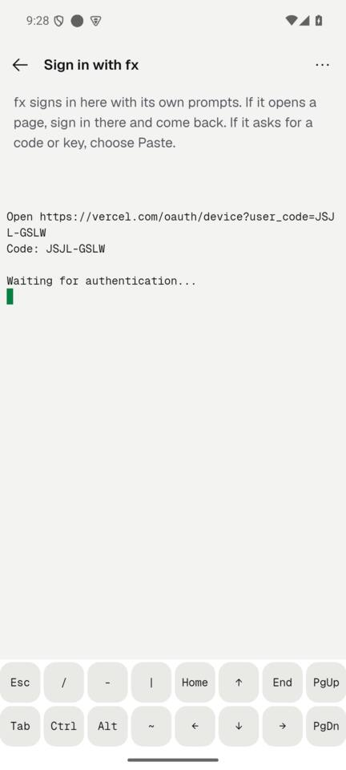
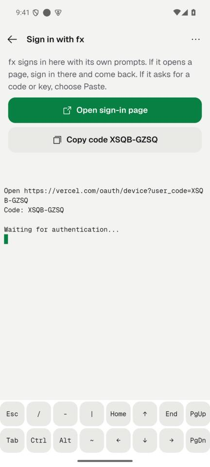
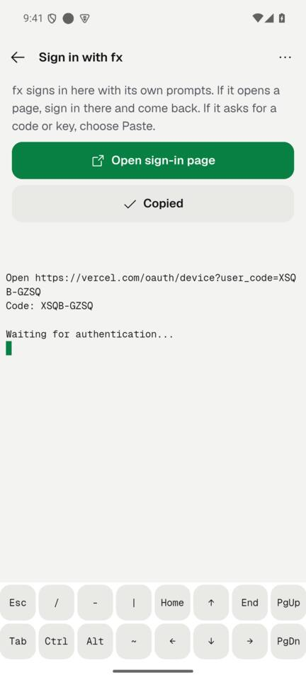
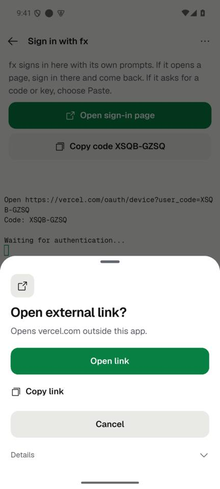

# FA1: "Open sign-in page" and "Copy code" in the sign-in terminal (2026-10-07)

**Finish line:** when an agent's sign-in prints an https sign-in page and a one-time code, the terminal screen shows them as kit buttons: "Open sign-in page" (through the app's link policy, `openAgentSignInPage` → `openExternalLink`, never `launchUrl`) and "Copy code ABCD-EFGH" (clipboard, then "Copied" for a moment).
**Non-goal:** completing the sign-in for the person, or reading Claude's pasted code (the app never reads it).

## What changed

- `lib/domain/agent_sign_in_output.dart`: pure reader of the terminal rows. Joins rows the terminal wrapped, puts back a page a program broke at the right edge, strips ANSI (CSI/OSC) sequences, takes the newest `https` page and never a plain `http`, `localhost`, `*.localhost`, `127.*`, `::1` or `0.0.0.0` page. The code is the page's `user_code` or an upper-case `XXXX-XXXX` token on a line that says "code" (or the two after it), with at least one letter.
- `lib/ui/screens/agents/agent_sign_in_terminal.dart`: listens to the shell's terminal, reads its last 200 rows, and shows a `KitActionBlock` (primary: open page, secondary: `KitAction.copy`) above the terminal while the sign-in runs.
- Copy: `agentsSignInOpenPage`, `agentsSignInCopyCode` (en + ar).

## Real output shapes covered by tests

| Agent | Output | Result |
|---|---|---|
| fx | `Open https://vercel.com/oauth/device?user_code=XSQB-GZSQ` / `Code: XSQB-GZSQ` (seen on the emulator) | both buttons |
| Codex `login --device-auth` | `https://auth.openai.com/codex/device`, then "Enter this one-time code" and `ABCD-12345` | both buttons |
| Claude | `https://claude.ai/oauth/authorize?…` broken across rows, "Paste code here if prompted >" | Open only, no code |
| any | localhost / 127.0.0.1 / plain http | no buttons |

Tests: `test/agent_sign_in_output_test.dart` (11), `test/agent_sign_in_terminal_test.dart` (6 widget tests). Removing the edge re-join or the localhost rule makes 4 of them fail (checked).

## Device evidence (emulator-5554, release build from this branch)

Agents → fx ("Sign in needed") → Sign in with fx → terminal running `fx login`.

| Before | After | Copy tapped | Open tapped |
|---|---|---|---|
|  |  |  |  |

"Open sign-in page" for fx goes through the "Open external link?" sheet naming vercel.com (it is not Claude's verified page). The device codes shown were short-lived and are expired.

## Accessibility

Both are kit buttons (48 dp, labelled); the code in the label is LTR-isolated for Arabic; "Copied" is announced once by `KitCopy`.

## Privacy and security

Nothing read from the terminal leaves the phone. The page opens only through the link policy; the code goes to the clipboard only when the person taps Copy.
