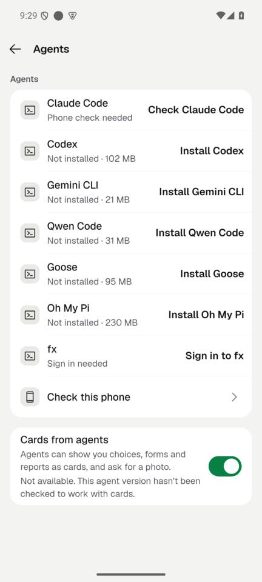
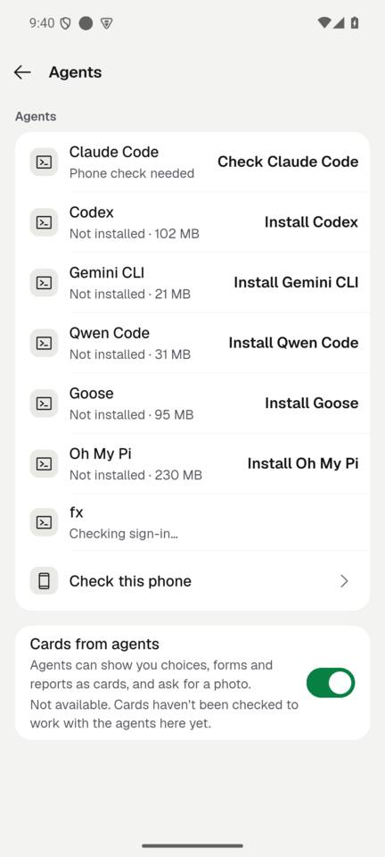

# FA5: the Cards setting names the agent each status line is about (2026-10-07)

**Finish line:** no "Cards from agents" status line says "This agent version…" without naming the agent.
**Non-goal:** changing which agents are qualified for cards.

## What changed

- `GenUiSetupUnavailable`, `GenUiSetupPartial` and `GenUiSetupFailed` carry `affected`: the agents the reason is about (default empty).
- `ManagedGenUiInstaller` records each agent's own problem and fills `affected` with the agents that hit the reported one.
- `genUiProblemText` names them with `AgentToolAdapter.displayName` for "not checked", "couldn't be told", "didn't pass the check" and "couldn't be removed". With no agent known it says "Cards haven't been checked to work with the agents here yet." (the "This agent version" wording is gone in en and ar).

Examples: "On for Claude Code. OpenCode hasn't been checked to work with cards yet."; "Couldn't turn this on. Claude Code couldn't be told about cards."

Tests: `test/agent_card_view_test.dart` ("each status line names the agent it is about"), `test/gen_ui_install_test.dart` (affected agents in three cases).

## Device evidence (emulator-5554, OpenCode 2 in-app Ubuntu)

| Before | After |
|---|---|
|  |  |

On this connection the status comes from the connection's own fallback (`lib/state/connection/gen_ui.dart`, enabled but no setup result), which names no agent, so the device shows the agent-less line. Naming the agent there needs the connection to pass its agents (`affected`) into that fallback; that file is owned by the connection lead and was not edited.
