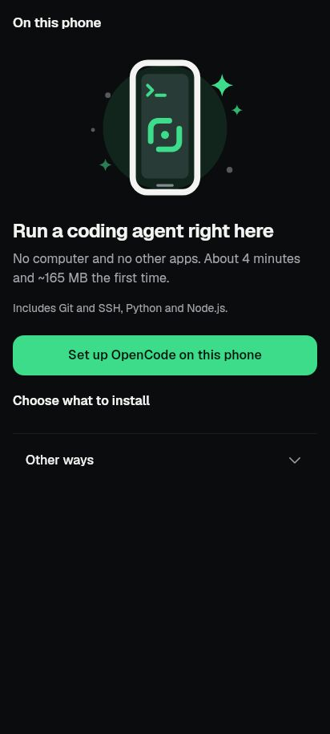
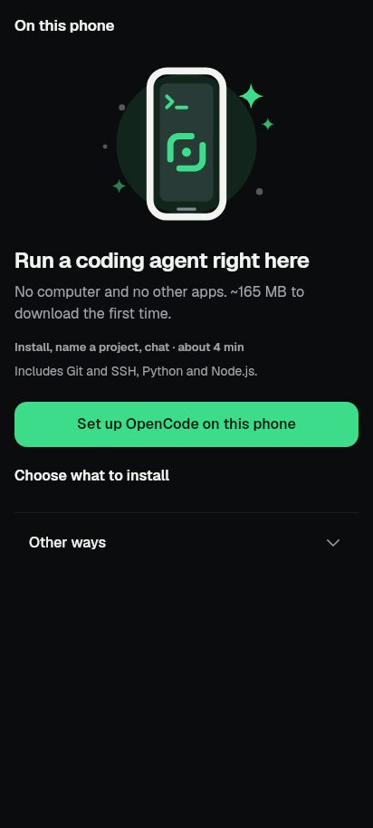
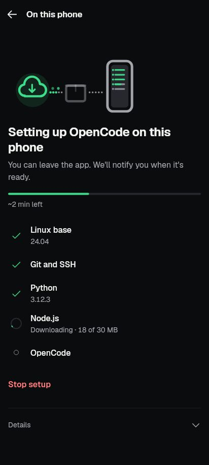
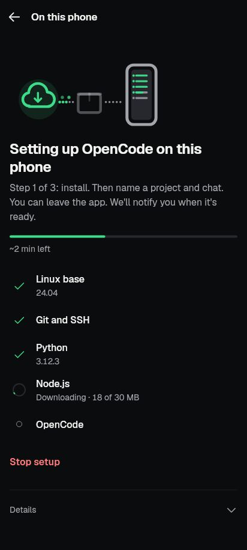

# FB2: the whole setup journey in one line (2026-10-07)

## What changed

Phone setup showed the install only. A newcomer could not see what comes
after the download, which is the longest wait of the first run. Now:

- **Start screen (A)**, fresh phone: under the promise, one line
  "Install, name a project, chat · about 4 min". The time moved out of the
  promise into this line, so it is said once; the promise keeps the size
  ("No computer and no other apps. ~165 MB to download the first time.").
  A phone that fails the pre-flight check (32-bit, low space, low memory)
  gets no step line: it is told why instead.
- **Progress screen (B)**, first setup only: the note under the title reads
  "Step 1 of 3: install. Then name a project and chat. You can leave the app.
  We'll notify you when it's ready." Updates and added tools keep the old
  note, since nothing is named or opened after them.

## Where N comes from

`setupStepsText` (`lib/ui/screens/phone_setup/phone_setup_selection.dart`)
uses the same registry estimate as the rest of the screen: the sum of
`estimatedSeconds` of what Set up really installs (with dependencies),
rounded to minutes, never below one. The default selection is
15 + 60 + 40 + 20 + 100 + 15 s = 250 s, so "about 4 min". Customize changes it
(Python off: "about 3 min").

Measured runs agree with that order of size
(`docs/qa/phone-setup-v2-2026-09-24/README.md`): the v2 run reached
"OpenCode is ready" 121 s after continuing a 46%-done job; the setup-engine
proof on a fast network finished the parts in about 1.5 min plus Node.js;
the older Ubuntu-npm build took 621 s, which was then fixed. Naming a project
and opening the chat take seconds, so the minutes are the install.

## Evidence

| | Before | After |
|---|---|---|
| Start (A) |  |  |
| Progress (B) |  |  |

Rendered by `tool/capture/front_door_test.dart` (412x915 dp, dark, real
fonts; scenes from `test/support/phone_setup_scenes.dart`), then converted to
JPG. Not taken on the emulator: the start screen's fresh state needs a phone
with nothing set up, and the shared emulator's app data must not be cleared.

## Tests

`tool/qa/machine_lock.sh test -- flutter test --concurrency=1`:

- `test/phone_setup_start_screen_test.dart`: the step line with the registry
  time under the promise (en and ar), the time follows Customize, and no
  step line when the pre-flight check blocks setup. Fails without the change
  (the line did not exist). Two tap tests now scroll to the button first:
  the 800x600 test surface is shorter than the page.
- `test/phone_setup_progress_screen_test.dart`: first setup shows the step
  note; an update keeps the plain leave note.
- Also run, all passing: `revamp/screen_phone_1_test`,
  `aiteam_component_test`, `phone_setup_notification_route_test`,
  `phone_setup_termux_screen_test`, `phone_setup_termux_job_screen_test`,
  `l10n_coverage_test`, `kit_ratchet_test`.

## Copy

en and ar in `lib/l10n/app_*.arb`: `phoneSetupStartSteps`,
`phoneSetupStartStepsTime`, `phoneSetupProgressFirstSetupNote`;
`phoneSetupStartPromise` / `phoneSetupStartPromiseNoSize` lost their time
placeholder.
