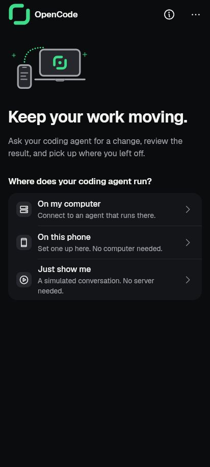
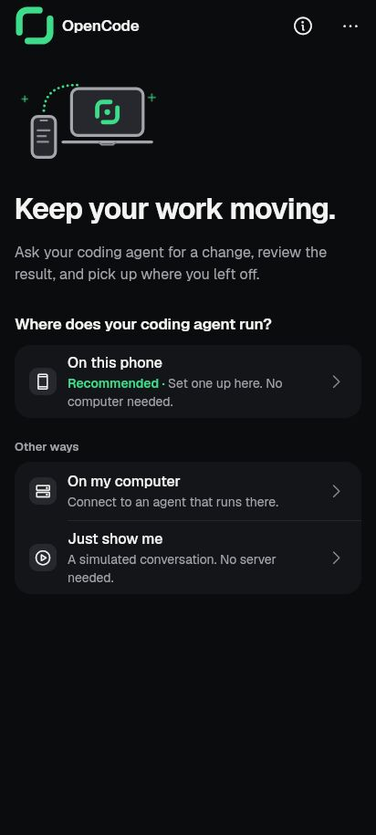

# FB3: one clear default on the first-run welcome (2026-10-07)

## What changed

Someone with no server saw three equal choices, with "On my computer" first.
Now the phone choice leads and says **Recommended**, and the computer and the
demo follow under **Other ways**. A platform without the phone path (desktop,
web) keeps the two choices as before, with nothing marked.

- `lib/ui/screens/servers/server_rows.dart` (`_WelcomeView`): the phone row in
  its own group with "Recommended · Set one up here. No computer needed.";
  "Other ways" holds the computer and the demo.
- `lib/ui/kit/kit_row_parts.dart`: new `kitRecommendedSpan`, the accent
  lead-in word for a row's supporting line (like `kitCurrentSpan`), from the
  existing `kitChoiceRecommended` string. Words, not colour alone.
- `lib/l10n/app_ar.arb`: Arabic for `kitChoiceRecommended` ("موصى به"), which
  was missing.

## Evidence

| Before | After |
|---|---|
|  |  |

Rendered by `tool/capture/front_door_test.dart` (412x915 dp, dark, real
fonts; `--dart-define=FRONT_DOOR_CAPTURE=before` was run on the tree before
the change), then converted to JPG.

## Tests

`tool/qa/machine_lock.sh test -- flutter test --concurrency=1`:

- `test/first_run_welcome_test.dart`: the phone row comes first and its
  supporting line reads "Recommended · Set one up here. No computer needed.";
  "Other ways" sits between it and the computer; only one row is recommended;
  desktop shows neither "Other ways" nor "Recommended". These assertions fail
  on the old order.
- `test/phone_setup_welcome_entry_test.dart`: the running-setup line test now
  uses a phone-sized surface so the longer lazy list is built.
- Also run, all passing: `first_run_computer_path_test`,
  `termux_clarity_test`, `desktop_platform_gating_test`,
  `termux_running_server_test`, `add_server_steps_test`, `kit_ratchet_test`.

Not run on the emulator: the welcome only shows with no saved server, and
the shared emulator's app data must not be cleared.

## Accessibility

The word "Recommended" is part of the row's supporting text, so TalkBack
reads it with the choice; the accent colour only repeats it.
