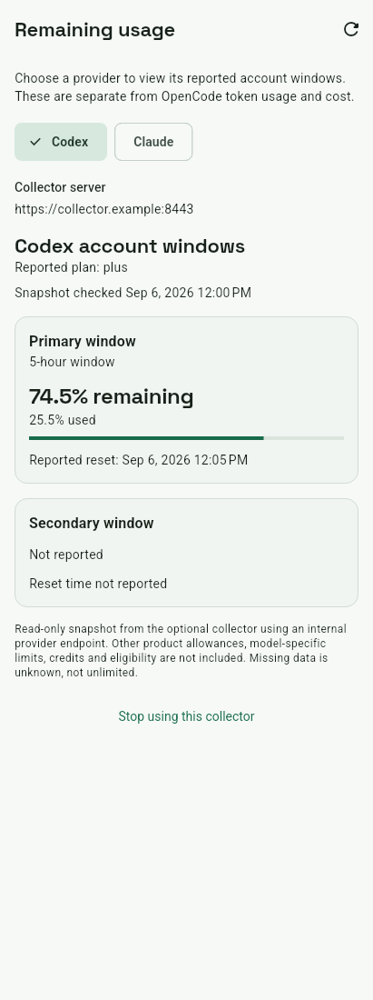

# Remaining usage — synthetic widget preview

The optional Codex collector view uses the production Flutter screen, app theme
and bundled fonts with synthetic data. This is not a provider-account capture,
device screenshot, live quota check, or TalkBack run.

Reproduce from the repository root with the pinned Flutter development toolchain:

```sh
OC_QUOTA_CAPTURE=docs/qa/provider-quota/remaining-usage.png \
  flutter test --no-pub --concurrency=1 test/provider_quota_screen_test.dart \
  --plain-name "synthetic remaining usage rendered preview"
```

The capture is 411×1100 logical pixels, DPR 1. The same test file separately
checks 360×740 at 2.5× text with a 320dp keyboard inset, keyboard actions,
light/dark semantics, 48dp targets and reduced motion. Those automated checks
do not establish physical-device accessibility or native iOS compatibility.



The operator must separately install and secure the collector as described in
[`tool/quota/README.md`](../../../tool/quota/README.md). App consent lasts only
for the screen visit; no provider tokens, automatic polling, or quota storage
are part of this first slice.
