# OpenCode Mobile 1.3.0+53 — before and after

Each picture is one full phone screen. **Before** is the public 1.2.0+52; **after** is 1.3.0+53. Both were taken on an Android emulator against a real Claude Code helper and a real OpenCode server, with a demo project. The full notes are in [v1.3.0+53.md](../v1.3.0+53.md).

## Claude Code chats: files, changes and terminals

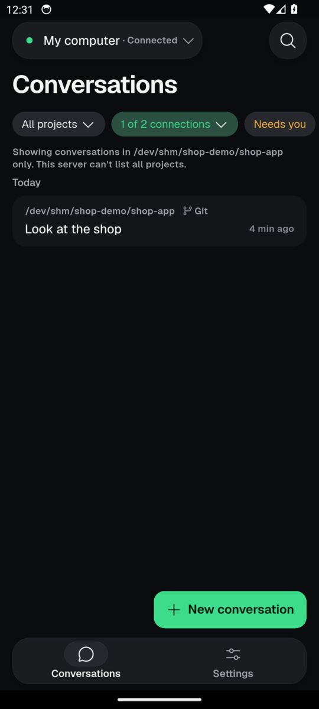

*Before: talking to Claude Code gave you only Conversations and Settings, with no Files tab.*

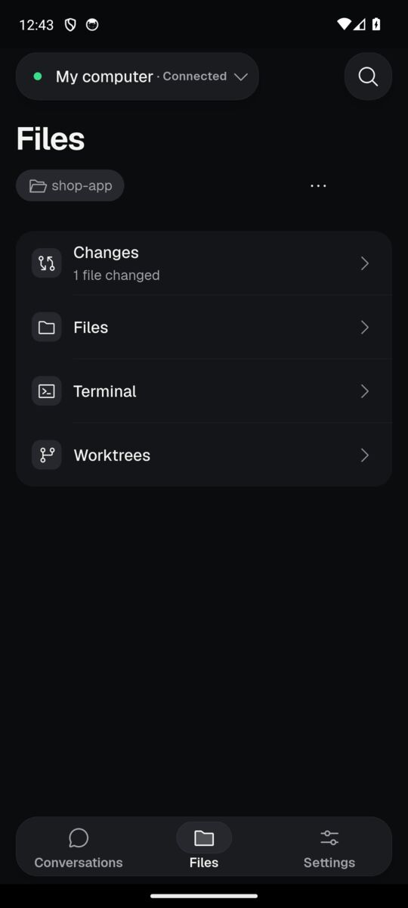

*After: a Files tab appears with Changes, Files, Terminal and Worktrees for the project.*

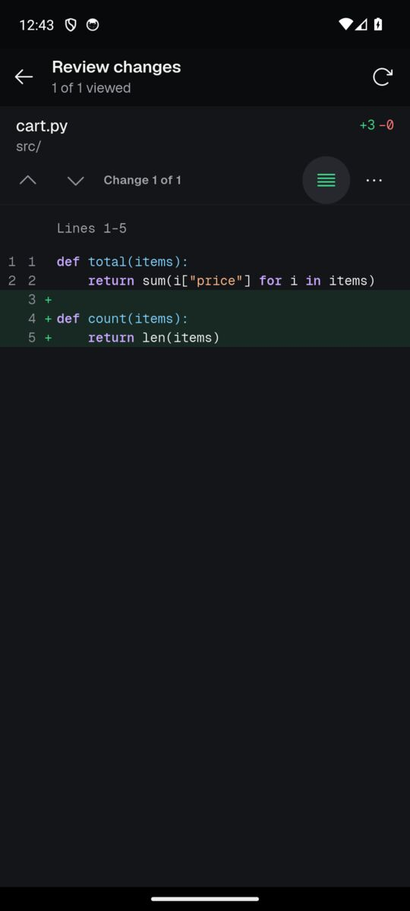

*New: you can review the edit Claude Code left uncommitted, line by line.*

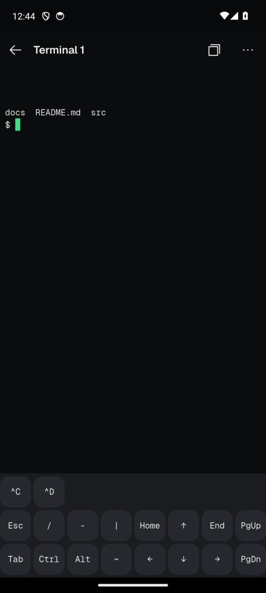

*New: you can open a terminal on your computer from the phone and run commands like ls.*

## Fast mode

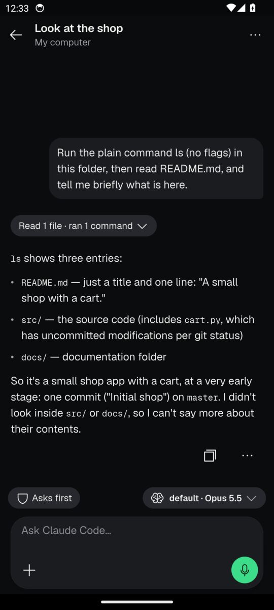

*Before: the message box for Claude Code had no Fast mode switch.*

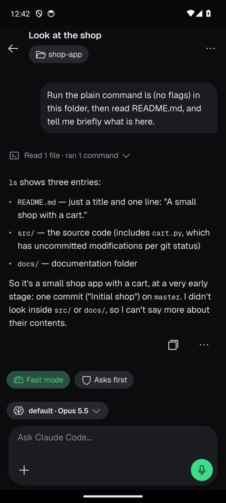

*After: a Fast mode chip sits above the message box and shows when it is on.*

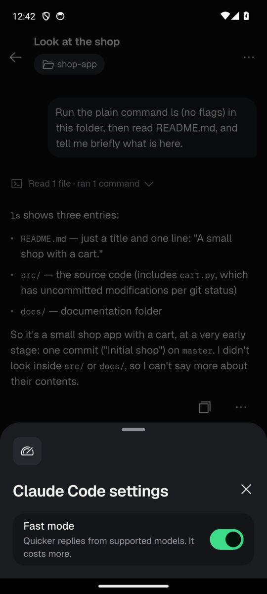

*After: tapping the chip opens Claude Code settings, where Fast mode is a simple switch.*

## Archive and delete conversations

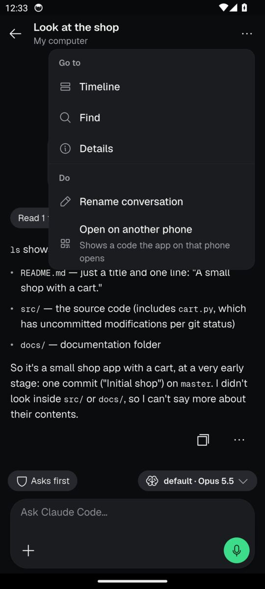

*Before: a Claude Code conversation's menu could not archive the conversation.*

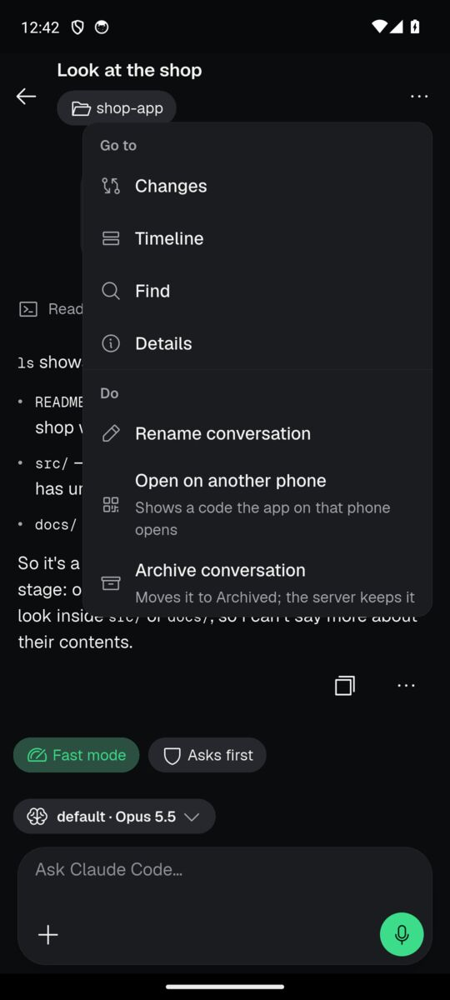

*After: the menu offers Archive conversation to tidy it away.*

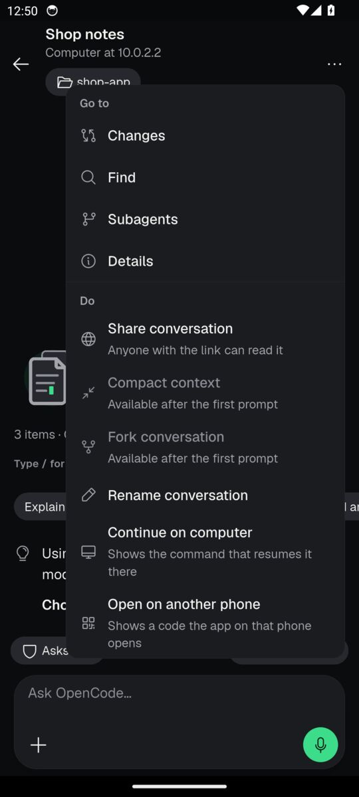

*Before: an OpenCode conversation's menu had no Archive or Delete.*

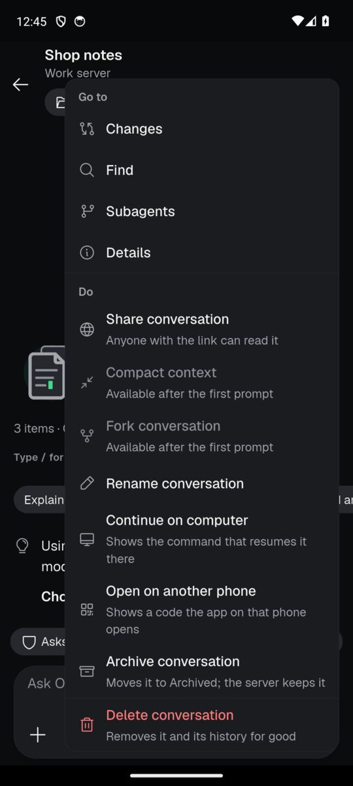

*After: the menu has Archive conversation and Delete conversation.*

## The computer's page

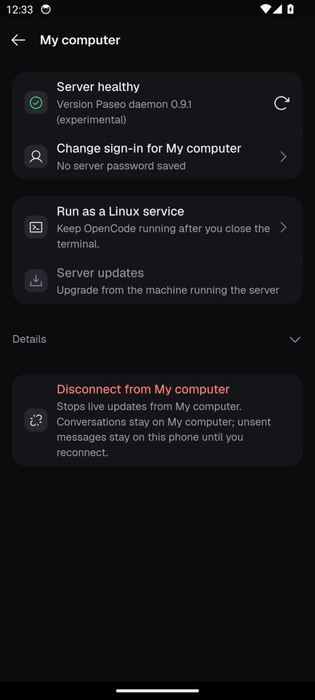

*Before: a Claude Code computer's page could only check health, change sign-in or disconnect.*

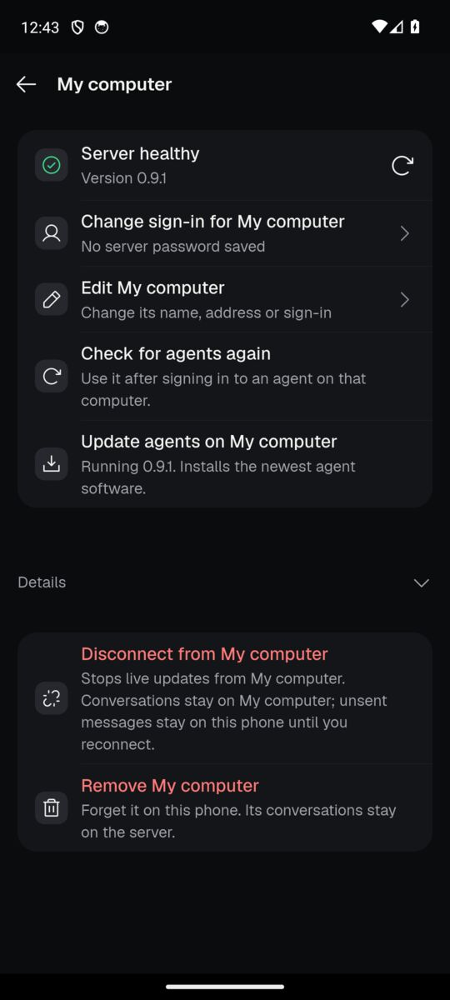

*After: the page can update its agents, edit or remove the computer, and check for agents again.*

## Import from Claude Code

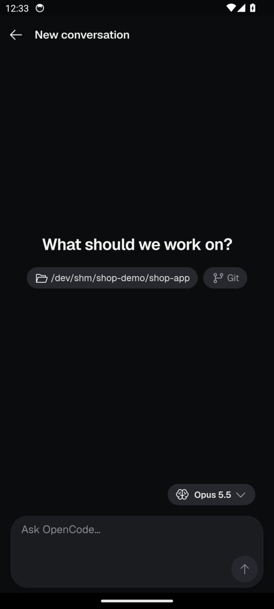

*Before: the new conversation screen had no way to bring in a chat from Claude Code.*

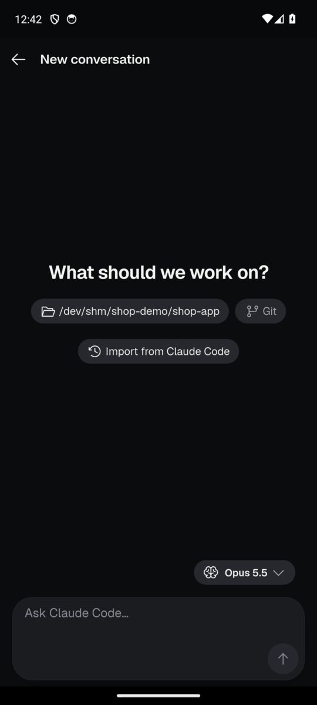

*After: an Import from Claude Code chip lets you pick up a conversation started on your computer.*

## Search inside files (OpenCode servers)

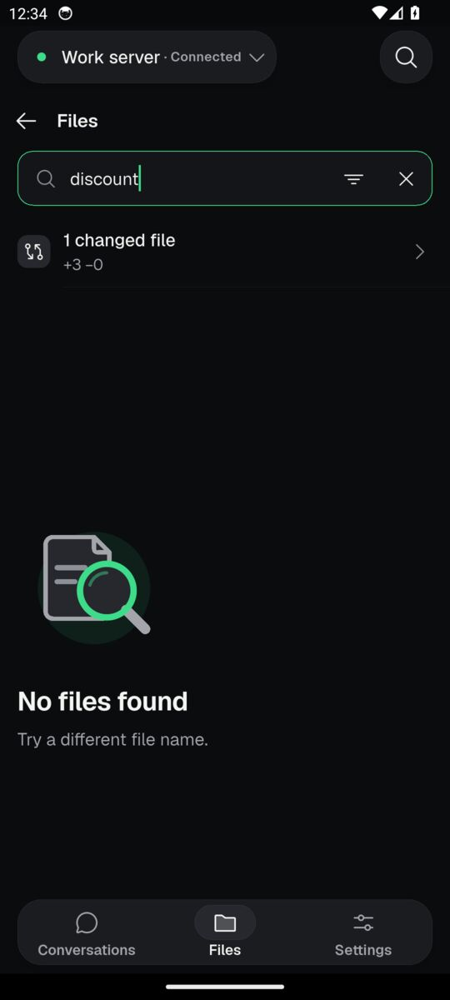

*Before: searching a word from inside a file found nothing, because only file names were searched.*

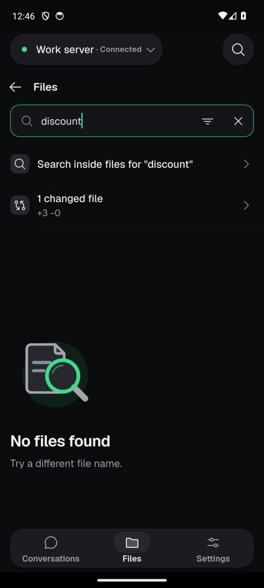

*After: a Search inside files row appears for the word you typed.*

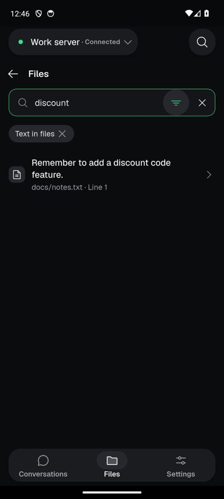

*After: tapping it lists the matching line, its file and its line number.*

## The message box names the agent

*Before: the new conversation box for a Claude Code computer said Ask OpenCode.*

*After: the same box now says Ask Claude Code.*

## Not pictured

- **AI Team** pause, delete, force stop and scheduled jobs: no AI Team host was available for screenshots; they are checked by tests.
- **Tool answers in Claude Code steps** and the plain-words error messages: the demo didn't produce a clear example.
