# OpenCode Mobile 1.3.0+53 — before and after

**Before** is the public 1.2.0+52; **after** is 1.3.0+53. Each picture is one real phone screen from an Android emulator, connected to a real Claude Code helper and a real OpenCode server, with a demo project. Full notes: [v1.3.0+53.md](../v1.3.0+53.md).

| | Before (1.2.0) | After (1.3.0) |
|---|---|---|
| **Claude Code chats get a Files tab** | 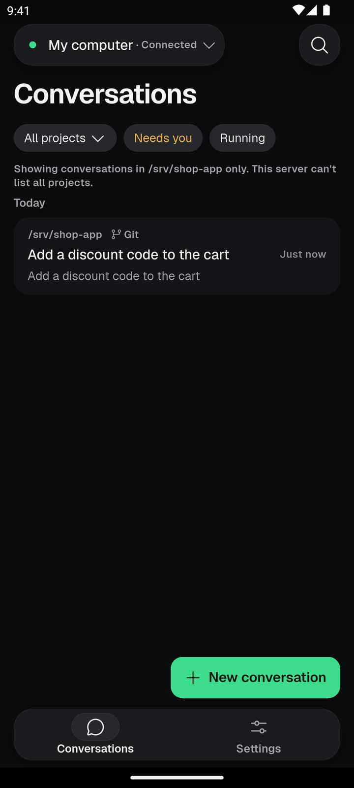 Before: a Claude Code server has no Files tab. | 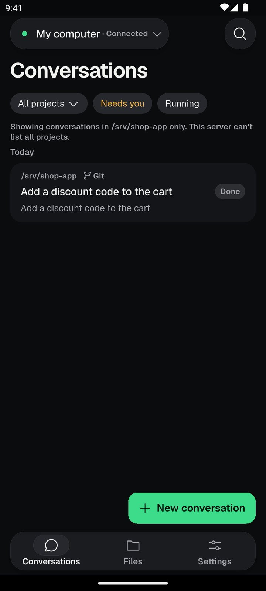 New: a Claude Code server has a Files tab for the project's files, changes and terminal; finished conversations show Done. |
| **Changes made by Claude Code** | — | 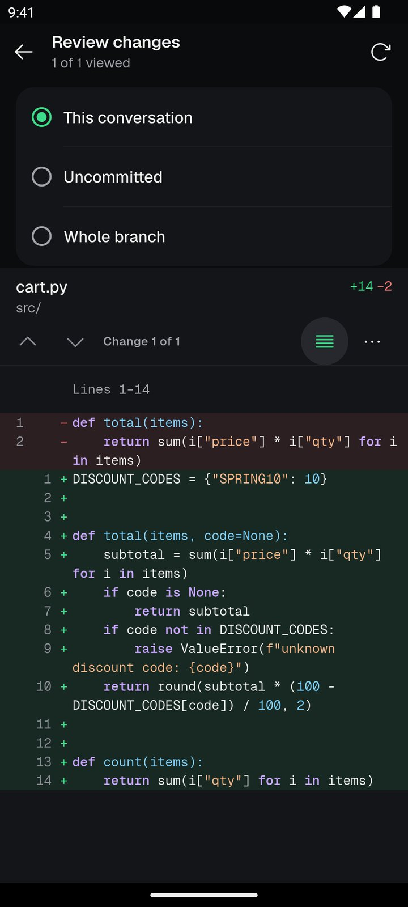 New: a Claude Code conversation shows what changed in the project. |
| **A terminal on your computer** | — | 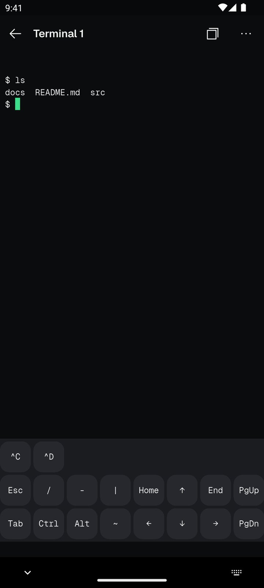 New: a terminal in the project, from a Claude Code conversation. |
| **Fast mode chip** | — | 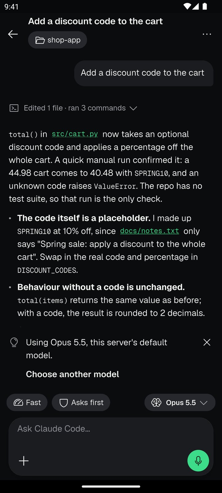 New: Fast mode is one chip in the row above the message box. |
| **Claude Code settings** | — | 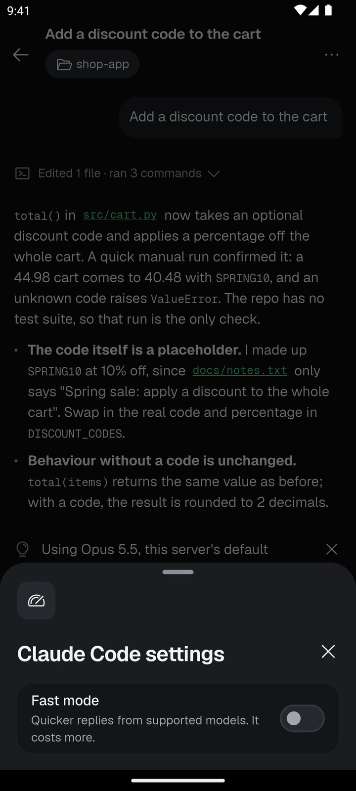 New: tapping the chip opens Claude Code settings, where Fast mode is one switch. |
| **Claude Code conversation menu** | 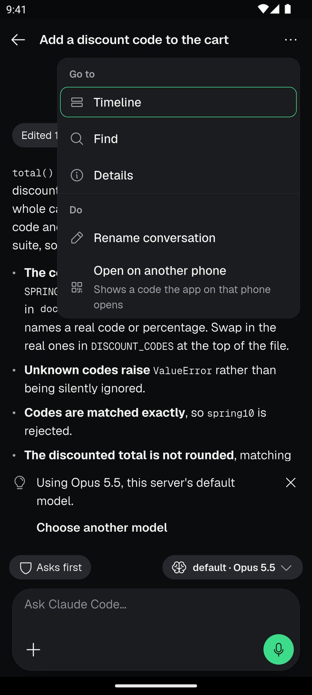 Before: a Claude Code conversation's menu had no Changes or Archive. | 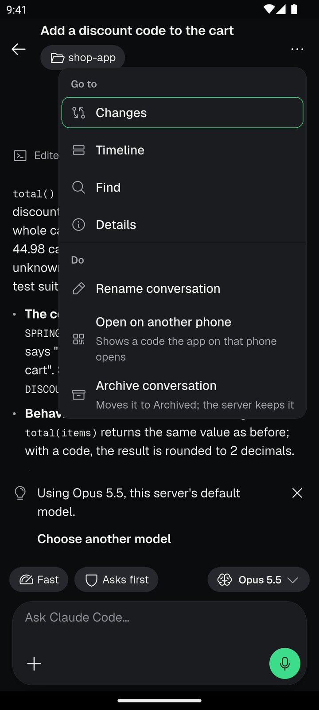 After: the menu adds Changes and Archive conversation. |
| **OpenCode conversation menu** | 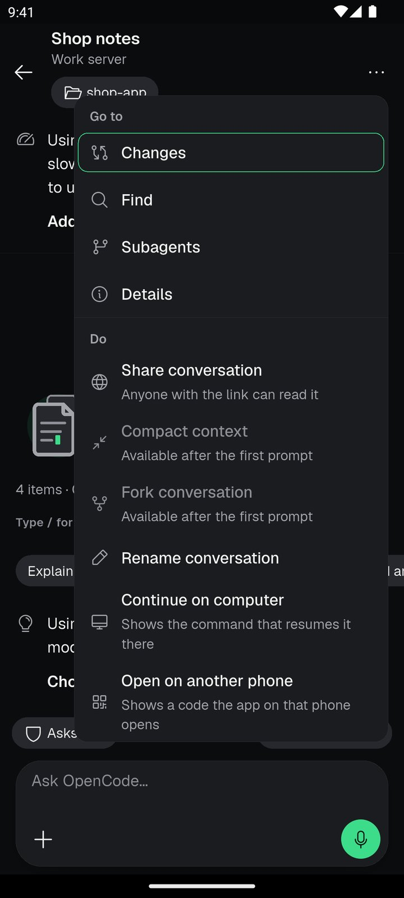 Before: an OpenCode conversation's menu had no Archive or Delete. | 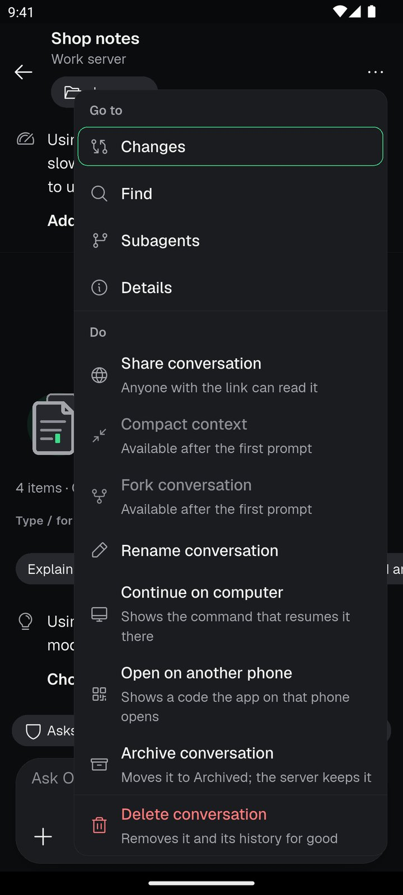 After: the menu adds Archive conversation and Delete conversation. |
| **The computer's page** | 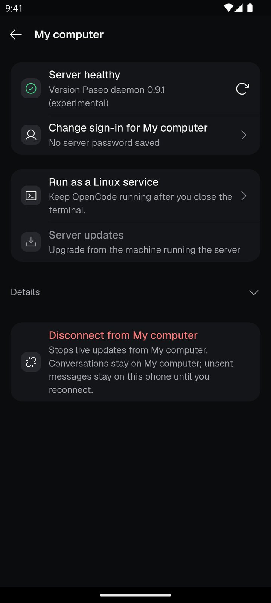 Before: the page of a Claude Code server. | 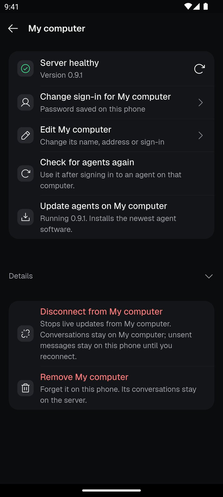 After: the page can edit or remove the computer, check for agents again and update them. |
| **Import from Claude Code** | 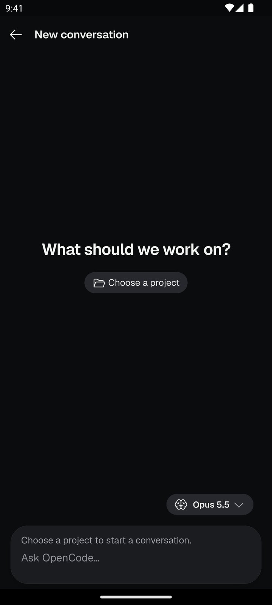 Before: the new-conversation page of a Claude Code server. | 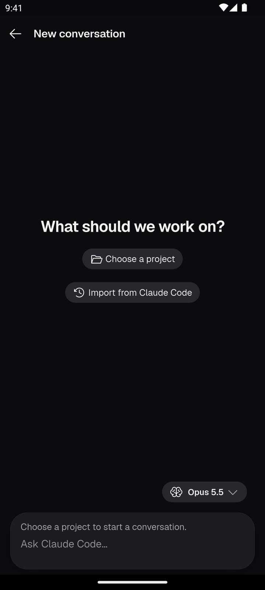 After: the new-conversation page offers Import from Claude Code. |
| **Search inside files (OpenCode servers)** | 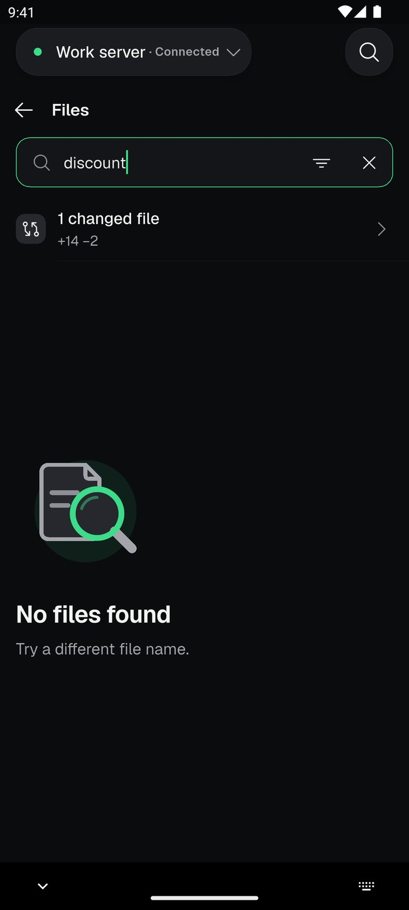 Before: searching Files for a word finds only file names, so nothing comes up. | 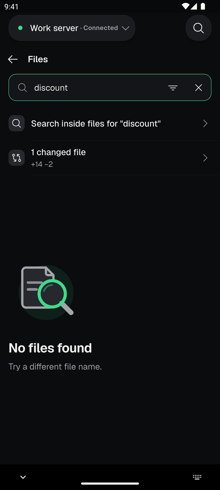 After: searching Files for a word offers to search inside the files. |
| **Search results** | — | 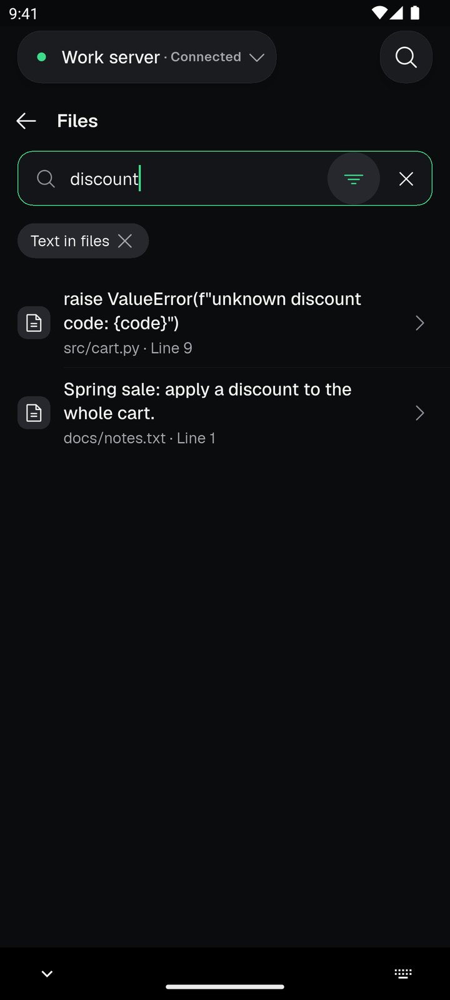 New: the lines that contain the word, in each file. |
| **The message box names the agent** | 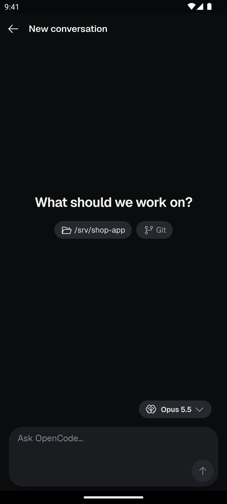 Before: a new Claude Code conversation said Ask OpenCode. | 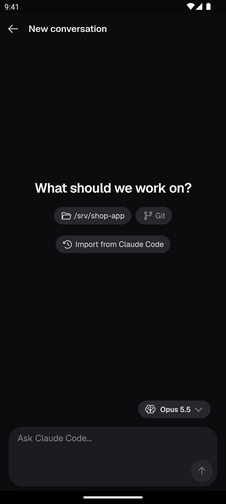 After: the box names the agent: Ask Claude Code. |
| **Delete a conversation** | — | 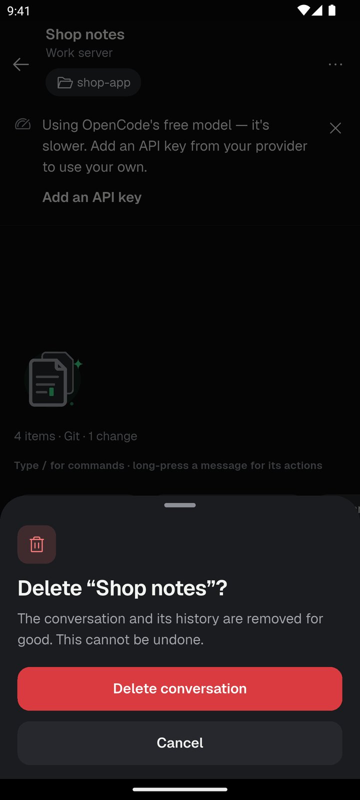 New: deleting a conversation asks first and names it. |
| **Tools as one page with tabs** | 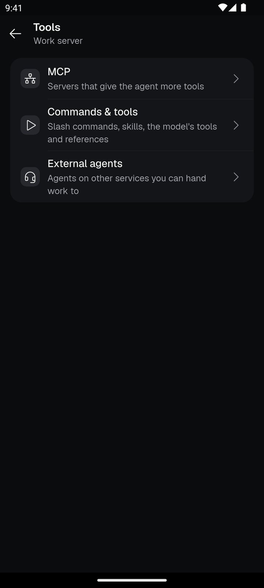 Before: Tools showed two sections, MCP and External agents. | 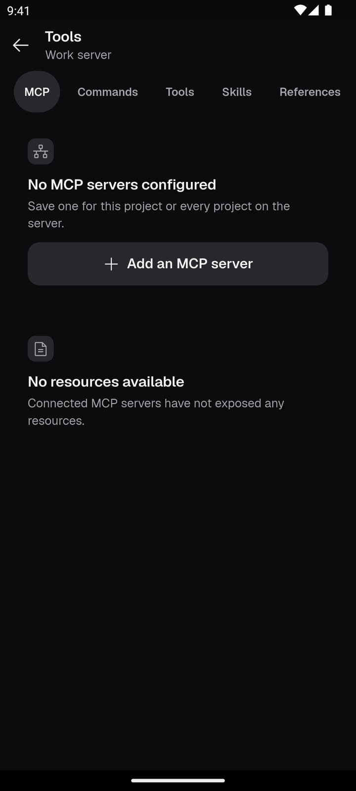 After: Tools is one page with tabs for MCP, Commands, Tools, Skills and References. |

## Not pictured

- **AI Team** pause, delete, force stop and scheduled jobs: no AI Team host was available for screenshots; tests cover them.
- **Tool answers in Claude Code steps** and the plain-words error messages.

Pictures were taken automatically from `tool/shots/release.toml`; every capture passed a check that no private names or addresses are on screen.
